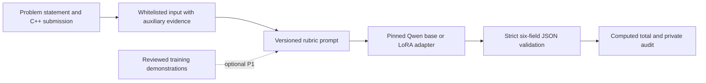

# Task 1 grading redesign plan

Prepared on 2026-10-06 from the completed Kaggle pilot. The adapter trained and saved successfully, but the evidence is too limited to establish improvement over untuned Qwen or reliable grading accuracy. The next design preserves the six-field grading contract and the working Qwen3.5-4B QLoRA runtime. It prioritizes trustworthy comparisons, clearer grading semantics, and representative labeled data.

Status: proposed design; implementation and new GPU experiments have not started. The implementation checklist is [todo.md](todo.md). This extends the scope and constraints in [PROJECT_PLAN.md](../docs/project/PROJECT_PLAN.md).

## Observed limitations

The private audit is `outputs/kaggle-upload/fine-tune-result-audit.json`. Its saved predictions and weights were checked offline; a fresh GPU inference repeat was not part of that audit. Student identifiers, submissions, reference feedback, and predictions stay in ignored private output directories.

| Finding | Verified evidence | Consequence |
|---|---|---|
| Tiny development set | 26 training records, six validation records, no test records | Validation selected the checkpoint and cannot establish final generalization |
| Undergrading | Reloaded QWK 0.6098; total MAE 2.3333; five of six predictions below reference; mean signed error -2.3333 | Inspect score coverage and rubric decisions before increasing training duration |
| Multi-problem weakness | MAE 4.0 on three multi-problem records versus 0.6667 on three single-problem records | Report problem-type slices and component errors; slice estimates are unstable at this size |
| Score distribution mismatch | Multi-problem training mean 3.25 versus validation mean 9.33 | Type-only splitting does not guarantee comparable score coverage |
| Ambiguous evidence | 12 training and three validation records flagged for conflicting exam weights; one training compiler conflict and one test conflict | Preserve labels and provenance; review meaning instead of automatically rewriting grades |
| Evaluation disagreement | Trainer QWK 0.6453 versus reloaded QWK 0.6098; one rubric field changed despite identical final/checkpoint weights | Checkpoint selection needs the same generation runtime as final prediction |
| Missing learned baseline | Same-split heuristic MAE 3.6667; untuned Qwen was not evaluated | Improvement attributable to fine-tuning is unproven |
| Incomplete historical model provenance | Old adapter metadata records `main`; cache evidence supplies a commit but does not prove every old load used it | Preserve the old run; establish immutable provenance for new comparisons |

The training/validation distributions recomputed from the prepared private files are:

| Problem type | Training count | Training mean total / 10 | Validation count | Validation mean total / 10 |
|---|---:|---:|---:|---:|
| Multi-problem | 12 | 3.25 | 3 | 9.33 |
| Single-problem | 14 | 6.86 | 3 | 3.33 |

This mismatch is a plausible contributor to errors, not a demonstrated cause. Problem type and exam identity are also confounded in this fixture. All three multi-problem validation records have weight conflicts, so this run cannot separate the effects of problem type, score coverage, and ambiguous policy. The single-problem QWK of 0.9605 on three records does not establish strong generalization.

The training mechanism itself passed useful checks: 16,232,448 trainable adapter parameters, finite weights, exact final/checkpoint equality, no ID or normalized-code overlap, no detected reference leakage in Task 1 prompt construction, and six valid first-pass outputs. These support retaining the runtime while changing the research design.

## Scope and fixed contracts

- Keep Task 1 output exactly `compilable` 0–1, `io_format` 0–1, `logic` 0–4, `edge_case` 0–2, `complexity` 0–1, and `code_quality` 0–1. Compute the total in code; do not ask the model for a separate total.
- Keep current-submission reference rubric, total, teacher feedback, and error labels out of model inputs. Training demonstrations may expose their own rubric targets, never teacher feedback.
- Keep Task 2 and Task 3 behavior unchanged. Reuse current preparation, prediction, evaluation, validation, and packaging scripts.
- Use Qwen3.5-4B, NF4 QLoRA, rank 8, and the demonstrated single-T4 FP16 setup initially. The pilot's approximately 41-minute training duration and 8.55 GiB peak VRAM are measurements for this tiny dataset, not forecasts for larger datasets.
- Use versioned prompts/configurations, private artifacts, JSON/YAML/CSV, and existing retrieval. No new service, vector database, orchestration framework, or larger model is needed for this stage.

## Proposed grading flow

### Grading semantics

Create `v002.txt` with explicit dimension definitions and scoring anchors grounded in the supplied rubric. For multi-problem tasks, instruct the grader to inspect the named functions, relevant requirements, and prerequisite policy before selecting the aggregate six scores. This is a prompt-level change; it does not require exposing explanations or adding another inference pass.

Use authoritative definitions where available. Any interpretation that goes beyond the supplied rubric must be labeled as a development hypothesis and reviewed before becoming a grading rule. Compile/test logs remain auxiliary because function-only submissions or different harnesses can disagree with teacher annotations.

The known multi-problem statement uses weights 1/4/2/3, while its problem metadata lists 2.5 per problem. There is no supplied conversion to the six global rubric dimensions. Preserve that conflict and the original labels. Do not invent four subproblem score targets, mechanically apply prerequisite gates to global rubric values, or train four independent graders from global labels. Per-problem scoring is deferred until an authoritative mapping and suitable labels exist.

Optional P1 uses one reviewed, relevant training demonstration first. Existing duplicate exclusions remain active. Keep the complete query within the same measured input budget; skip an example with a recorded reason if it cannot fit. Add more examples only after demonstrating value and measuring T4 memory/context behavior.

### Data and evaluation protocol

1. Preserve the current split and metrics as a historical development result. These six validation records have already influenced checkpoint selection and error analysis.
2. Prefer lecturer-provided train/dev/test splits. Respect those assignments and audit overlap; do not rebalance official held-out data.
3. For locally generated development splits, retain normalized-code groups and add prospective score-band coverage within problem type where support permits. Proposed fixed bands are 0–3, 4–7, and 8–10; report group counts, unsupported bands, and achieved distributions. Never pick the seed or bins by model performance.
4. Group known related submissions using trustworthy identity metadata when available. Detecting no exact normalized-code overlap does not establish absence of near duplicates. Do not infer student identity from undocumented ID patterns.
5. If only the 32-record fixture remains available, use up to three fixed grouped folds for exploratory diagnosis with fixed hyperparameters. Do not use each reporting fold to select its own best epoch: use a fixed training duration or a separate inner development set. Previously inspected data and fold results remain development evidence.
6. Freeze the chosen method before evaluating new independent test data. If no new test data is available, explicitly retain a pilot-only conclusion.

Training/demo selection, any oversampling, and label review affect training only. Keep all held-out records and disclose conflict slices. Request additional real labels covering low, medium, and high scores for each problem type; repeating the existing 26 records does not create that coverage.

These separation and grouping requirements follow [scikit-learn's evaluation guidance](https://scikit-learn.org/stable/modules/cross_validation.html). With only two exams, leaving an exam out is a stress test, not a reliable estimate of unseen-exam performance.

### One canonical inference runtime

Both generated checkpoint evaluation and final prediction must use the same prompt rendering, chat template, thinking setting, token budget, greedy decoding, quantization, adapter dtype, mixed-precision context, attention backend, and cache policy. Training loss evaluation can retain its own appropriate precision context; it must not implicitly determine generation precision.

Use the existing generation function as the shared entry point and record resolved runtime settings. Compare in-memory evaluation with a freshly loaded saved adapter on the same GPU/software environment. If any six-field prediction differs, investigate the first divergence and do not certify parity or select a candidate from the disputed metric.

Checkpoint comparisons and reload parity use first-pass outputs. The prediction pipeline's bounded format-repair retry remains a separate operational measurement; report it explicitly rather than comparing a repaired prediction with a first-pass checkpoint metric.

The numerical cause of the old discrepancy is unresolved. Precision and cache differences are testable hypotheses. [PyTorch's reproducibility guidance](https://docs.pytorch.org/docs/2.14/notes/randomness.html) also makes clear that seeds alone do not guarantee identical results across releases or platforms; the parity gate is scoped to a recorded environment.

For new runs, save immutable base-model commit, source snapshot hashes, dataset/split/prompt hashes, adapter/checkpoint hashes, package versions, hardware, seed, and resolved runtime settings. The existing loader now pins remote base-model loads; verify that in the new Kaggle snapshot. Pin the embedding revision for P1 too. Do not rewrite historical `main` metadata to claim a certainty the artifacts do not establish.

### Controlled experiments

All comparisons below use the same prospective development protocol, base revision, permitted inputs, canonical evaluator, and measured runtime budget. New experiment IDs and output directories are required.

| Candidate | Prompt | Adapter | Purpose |
|---|---|---|---|
| P0 control | v001 | None | Measure actual untuned Qwen |
| P0 rubric | v002 | None | Isolate the prompt change |
| P1 rubric | v002 plus one training demonstration | None | Isolate retrieval after the prompt comparison |
| F0 control | v001 | Fresh pinned QLoRA | Establish fine-tuning effect against P0 control |
| F0 rubric | v002 | Fresh pinned QLoRA | Compare training with clearer scoring guidance against F0 control and P0 rubric |

Begin with P0 comparisons and runtime parity. Budget two new full fine-tunes on the primary development split, plus at most one follow-up training hypothesis if error analysis supports it. Possible follow-up: a lower learning rate, keeping data, prompt, rank, and evaluation fixed. Do not change learning rate, LoRA rank, sampling, prompt, and split together.

The optional three-fold exploratory check replaces the follow-up tuning campaign; its three separate trainings need their own GPU budget. Do not silently add it to the initial run cap. Do not extend epochs merely because training loss is low: the pilot already shows that loss and generated grading metrics need not rank checkpoints identically.

## Acceptance and selection

- Runtime: finite updates, save/reload integrity, complete prediction coverage, and exact six-field parity between checkpoint evaluation and fresh adapter load on the recorded environment. Failures are investigated before quality claims.
- Protocol: no forbidden reference input or train/held-out ID/code overlap; official split assignments preserved; no test-driven tuning; all score-support and conflict counts reported.
- Development ranking: require schema-valid outputs for every record, then rank by total QWK, with lower total MAE as the declared tie-breaker. Report total signed bias, component MAE, exact totals, errors exceeding two points, first-pass validity, and retry rate alongside that ranking. This prospective rule does not change the old run's selection history.
- Design claim: attribute improvement to a factor only through its paired control. Prefer a candidate with lower paired MAE and non-decreasing QWK over its relevant control, while disclosing any worsening problem-type or conflict slice. If metrics disagree, keep that tradeoff visible instead of claiming a universal improvement.
- Final quality claim: evaluate the frozen candidate against untuned Qwen on new independent labeled test data. Report sample/group support and uncertainty where meaningful. Six development records cannot support a stable accuracy threshold or a statistical improvement claim. Set the acceptable grading-error threshold with the lecturer before seeing test outputs.

## Execution order

1. Review data authority and add an aggregate distribution audit.
2. Resolve generation parity on Kaggle.
3. Freeze a prospective development protocol.
4. Test v002 using untuned Qwen.
5. Test one training-only demonstration.
6. Run the paired fine-tunes only after the earlier gates pass.
7. Produce paired error/bias reports.
8. Freeze and evaluate on independent acceptance data when available.

Detailed file ownership, dependencies, checks, and checkpoints are in [todo.md](todo.md). Initial gates address the highest risks before expensive training. Implementation remains within the project's effective two-week model-development window.

## Risks and unresolved inputs

| Risk or input | Handling |
|---|---|
| No authoritative multi-problem weight mapping | Preserve conflict; keep aggregate rubric supervision; defer per-problem score conversion |
| No additional labeled data | Report exploratory pilot results; do not manufacture an independent test claim |
| Sparse score/type combinations | Report unsupported cells; never break duplicate groups to satisfy stratification |
| Duplicate groups with inconsistent labels | Preserve group boundaries and labels; send disagreement for review rather than choosing a favorable target |
| Parity remains unresolved | Keep old artifacts; fix the runtime before selecting new checkpoints |
| Old model revision cannot be fully certified | Keep legacy adapter separate; use fresh pinned runs for controlled claims |
| Retrieval exceeds the query budget | Keep query intact and skip/log the demonstration; increase context only after a separate hardware check |
| Unknown lecturer grading tolerance | Agree the threshold before independent test predictions are examined |

The design can proceed with the existing global rubric while awaiting the authoritative weight mapping, additional labels, and final acceptance tolerance. Those missing inputs constrain the conclusions and optional extensions; they do not require a new grading framework.
